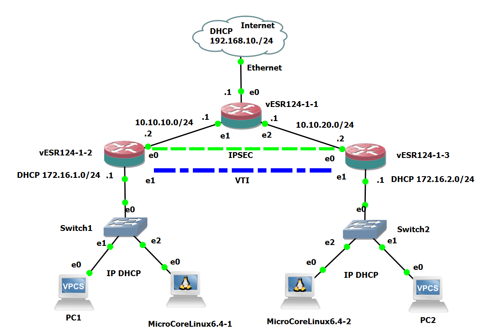

# Глава 14. [Настройка туннеля VTI](https://docs.eltex-co.ru/pages/viewpage.action?pageId=546144773#id-%D0%A3%D0%BF%D1%80%D0%B0%D0%B2%D0%BB%D0%B5%D0%BD%D0%B8%D0%B5%D1%82%D1%83%D0%BD%D0%BD%D0%B5%D0%BB%D0%B8%D1%80%D0%BE%D0%B2%D0%B0%D0%BD%D0%B8%D0%B5%D0%BC-%D0%9D%D0%B0%D1%81%D1%82%D1%80%D0%BE%D0%B9%D0%BA%D0%B0IPsecVPN)

### Что такое туннель VTI, его характеристики, достоинства и недостатки.

**VTI (Virtual Tunnel Interface)** --- логический интерфейс, который
представляет туннель виртуальной частной сети (VPN) между узлами. Он не
напрямую сопоставляется с физическим интерфейсом устройства, но
используется для организации зашифрованного туннеля.

 [cisco.com](https://www.cisco.com/c/en/us/td/docs/security/asa/asa919/configuration/vpn/asa-919-vpn-config/vpn-vti.html)[alliedtelesis.com](https://www.alliedtelesis.com/sites/default/files/documents/configuration-guides/interface_feature_overview_guide.pdf)[twingate.com](https://www.twingate.com/blog/glossary/virtual-tunnel-interface)[justogroup.ru](https://www.justogroup.ru/dokumentacija/cisco/marshrutiziruemye_seti/interfeys_virtualinih_tunneley_ipsec.pdf)[tele78.ru](http://tele78.ru/Docs/Cisco/pdf/marshrutiziruemye-seti/interfeys_virtualinih_tunneley_ipsec.pdf)

Интерфейсы виртуальных туннелей (virtual tunnel interfaces, VTI) IPsec
представляют собой тип маршрутизируемых интерфейсов на концах туннелей
IPsec. Это простой способ установки защиты между узлами для образования
перекрывающихся сетей. Интерфейсы VTI IPsec упрощают настройку IPsec для
защиты удаленных каналов, поддерживают мультиадресную рассылку, делают
проще управления сетью и балансировку нагрузки.
[www.justogroup.ru/dokumentacija/cisco/marshrutiziruemye_seti/interfeys_virtualinih_tunneley_ipsec.pdf](http://www.justogroup.ru/dokumentacija/cisco/marshrutiziruemye_seti/interfeys_virtualinih_tunneley_ipsec.pdf)

**Порты** для интерфейса VTI не существуют --- он не имеет портов, но
поддерживает маршрутизацию трафика через виртуальный интерфейс. Трафик
шифруется только при пересылке из VTI, трафик, поступающий в VTI,
расшифровывается и маршрутизируется соответствующим
образом. [cisco.com](https://www.cisco.com/c/en/us/td/docs/security/asa/asa919/configuration/vpn/asa-919-vpn-config/vpn-vti.html)[justogroup.ru](https://www.justogroup.ru/dokumentacija/cisco/marshrutiziruemye_seti/interfeys_virtualinih_tunneley_ipsec.pdf)[tele78.ru](http://tele78.ru/Docs/Cisco/pdf/marshrutiziruemye-seti/interfeys_virtualinih_tunneley_ipsec.pdf)

**Характеристики**

**Поддержка протоколов маршрутизации** --- можно использовать
динамическую или статическую IP-маршрутизацию.

**Гибкость отправки и приёма одноадресного и мультиадресного
шифрованного трафика** --- трафик шифруется или дешифруется при
пересылке в туннельный интерфейс или из него.

**Возможность использовать службы** --- пока туннель активен, с
интерфейсом VTI можно применять средства обеспечения качества
обслуживания (QoS), брандмауэр и другие службы безопасности.

**Два типа интерфейсов VTI** --- статические (SVTI) и динамические
(DVTI).

 [justogroup.ru](https://www.justogroup.ru/dokumentacija/cisco/marshrutiziruemye_seti/interfeys_virtualinih_tunneley_ipsec.pdf)[tele78.ru](http://tele78.ru/Docs/Cisco/pdf/marshrutiziruemye-seti/interfeys_virtualinih_tunneley_ipsec.pdf)

**Достоинства**

- **Гибкость маршрутизации**. Можно использовать динамическую или
  статическую IP-маршрутизацию для пересылки трафика через виртуальный
  интерфейс. Это упрощает настройку VPN по сравнению с сложным процессом
  использования списков управления доступом (ACL) с криптокартой в
  стандартных конфигурациях
  IPsec. [tele78.ru](http://tele78.ru/Docs/Cisco/pdf/marshrutiziruemye-seti/interfeys_virtualinih_tunneley_ipsec.pdf)[ecessa.com](https://www.ecessa.com/blog/benefits-of-virtual-tunnel-interface/)[justogroup.ru](https://www.justogroup.ru/dokumentacija/cisco/marshrutiziruemye_seti/interfeys_virtualinih_tunneley_ipsec.pdf)

- **Возможность использовать протоколы маршрутизации**. Информация о
  маршрутах распространяется через виртуальный туннель, маршрутизатор
  может установить отношения с соседними узлами через
  VTI. [tele78.ru](http://tele78.ru/Docs/Cisco/pdf/marshrutiziruemye-seti/interfeys_virtualinih_tunneley_ipsec.pdf)[justogroup.ru](https://www.justogroup.ru/dokumentacija/cisco/marshrutiziruemye_seti/interfeys_virtualinih_tunneley_ipsec.pdf)

- **Использование служб безопасности**. Пока туннель активен, с VTI
  можно применять средства обеспечения качества обслуживания (QoS),
  брандмауэр и другие службы
  безопасности. [tele78.ru](http://tele78.ru/Docs/Cisco/pdf/marshrutiziruemye-seti/interfeys_virtualinih_tunneley_ipsec.pdf)[justogroup.ru](https://www.justogroup.ru/dokumentacija/cisco/marshrutiziruemye_seti/interfeys_virtualinih_tunneley_ipsec.pdf)

- **Диагностические возможности**. На интерфейсе туннеля можно выполнять
  захваты пакетов, что помогает в поиске
  неисправностей. [twingate.com](https://www.twingate.com/blog/glossary/virtual-tunnel-interface)

VTI особенно полезен в сложных сетевых конфигурациях, например, для
создания сетей VPN с полной или частичной меш-сетью или для сетей с
перекрывающимися
подсетями. [twingate.com](https://www.twingate.com/blog/glossary/virtual-tunnel-interface)

**Недостатки**

- **Может не поддерживаться на удаленном оконечном устройстве**.

- **Отсутствует поддержка non-IP-протоколов**. VTI поддерживает только
  IP (unicast и multicast), в то время как GRE поддерживает и другие
  протоколы.

- **Сложность поиска неисправностей** по сравнению с некоторыми другими
  технологиями VPN.

 [support.ecessa.com](https://support.ecessa.com/hc/en-us/articles/203282505-Virtual-Tunnel-Interface-VTI-VPN)[samag.ru](https://samag.ru/archive/article/2074)

### Общие принципы конфигурации туннелей VTI (Virtual Tunnel Interface) на устройствах серии ESR.

- **Создание туннеля** и переход в режим его конфигурирования.
  Используется команда 

esr(config)# tunnel vti \<TUN\>

.

- **Указание параметров туннеля**: локального и удалённого IP-адресов,
  IP-адреса локальной стороны.

- **Настройка правил зон безопасности** или отключение firewall для
  туннеля. Используются команды 

esr(config-vti)# securityzone\<NAME\>

 или 

esr(config-vti)# ip firewall disable

.

- **Активирование туннеля** --- команда 

esr(config-vti)# enable.

 [docs.eltex-co.ru](https://docs.eltex-co.ru/pages/viewpage.action?pageId=55183533)[manualzz.com](https://manualzz.com/doc/o/2lj65j/eltex-esr-10-service-gateway-user-manual-ipsec-vpn-configuration)

### Пошаговая инструкция

Некоторые этапы конфигурации туннелей VTI на устройствах ESR:

- **Создание статического маршрута** до удалённой LAN-сети. Для каждой
  подсети, которая находится за IPsec-туннелем, нужно указать маршрут
  через VTI-туннель.

- **Создание профиля протокола IKE**. В профиле указываются параметры
  безопасности для защиты IKE-соединения: группа Диффи-Хэллмана,
  алгоритм шифрования, алгоритм аутентификации.

- **Создание шлюза протокола IKE**. В профиле указывается VTI-туннель,
  политика, версия протокола и режим перенаправления трафика в туннель.

 [mcgrp.ru](https://mcgrp.ru/files/viewer/262095/63)[mcgrp.ru](https://mcgrp.ru/files/viewer/262091/83)

### **Цель этой работы.**

Настроить туннель VTI+IPSEC между локальными сетями офиса и филиала
согласно схеме на Рис 15-1. Обеспечить связность локальных сетей офиса и
филиала между собой.

Рисунок 14-1. Схема сети с туннелем VTI+IPSEC.

### Первоначальная настройка.

Первоначальная настройка всех трех маршрутизаторов полностью аналогичная
порядку, описанному в главе 7 и необходимо просто повторить
последовательность команд конфигурации. Настройку зон файервола для
пропука пакетов утилиты traceroute необходимо повторить по командамам из
главы 8.

### Настройка туннеля.

На маршрутизаторе офиса нужно ввести следущие команды:

vesr124-1-2# config

Полный текст главы 14 на Бусти - 

### Сводка или ключевые выводы главы

- В этой главе вы кратко ознакомились организацией туннеля VTI.

- Приведено применение этого туннеля на практике.

- Приведен перечень команд для настройки туннеля и его шифрации в сети
  интернет и проверки маршрутизации в туннеле между узлами сети.

- Создан полноценныq VTI туннель для связности центрального узла сети и
  филиала между собой.

- Приведены команды проверки работы туннелей.

- В конце главы приведены полные конфигурационные настройки для
  рассматриваемой работы.

  Вывод.

  Туннель site-to-site VTI VPN преставляет собой простое и надежное
  решение для организации связи между локальными сетями разнесенных
  географически и обеспечивает шифрование передаваемых данных в туннеле.

  В следующей главе вы узнаете, как настраивается LT туннель.
