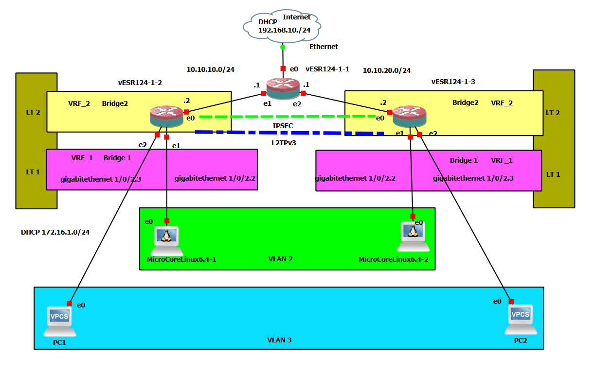

# **Глава 15. Динамическая маршрутизация OSPF поверх IPsec VTI туннелей**

### **Введение в архитектуру**

Динамическая маршрутизация OSPF поверх IPsec VTI туннелей представляет
собой enterprise-решение для построения отказоустойчивых
самовосстанавливающихся сетей. Данная архитектура сочетает преимущества
криптографической защиты IPsec с интеллектуальной маршрутизацией OSPF.

Ключевые преимущества:

Автоматическое восстановление маршрутов при обрывах туннелей

Балансировка нагрузки между несколькими каналами связи

Масштабируемость - простое добавление новых узлов

Самодиагностика - автоматическое обнаружение соседей

### **Цель работы.**

Поставлена задача- создать филиальную сеть типа Звезда из маршрутизатора
в офисе в виде HUB и двух филиалов в виде HUB-To-Spoke. Связь через сеть
Интернет между офисом и филиалами организовать в виде зашифрованных
туннелей VTI. Локальные сети филиалов должны быть доступны из офиса и
между собой. На первом этапе маршрутизация на основе статических
маршрутов, а затем -динамическая.

Адресная схема на рисунке 15-1 :

Адреса интерфейсов:

Маршрутизатор vesr124-1-1 провайдера для выхода в интернет:

Gigabitethernet 1/0/1 --- 192.168.10.51/24 получен от DHCP сервера
провайдера

Gigabitethernet 1/0/2 --- 10.10.10.1/24 соединение с офисом

Gigabitethernet 1/0/3 --- 10.10.20.2/24 соединение с филиалом 1

Gigabitethernet 1/0/4 --- 10.10.20.3/24 соединение с филиалом 2

Маршрутизатор офиса vesr124-1-2:

Gigabitethernet 1/0/1 --- 10.10.10.2/24 соединение с офисом

Gigabitethernet 1/0/2 --- 172.16.1.1/24 соединение с локальной сетью
офиса

Маршрутизатор филиала 1 vesr124-1-3:

Gigabitethernet 1/0/1 --- 10.10.20.2/24 соединение с провайдером
интернет

Gigabitethernet 1/0/2 --- 172.16.2.1/24 соединение с локальной сетью
филиала 1

. Маршрутизатор филиала 2 vesr124-1-4:

Gigabitethernet 1/0/1 --- 10.10.30.2/24 соединение с провайдером
интернет

Gigabitethernet 1/0/2 --- 172.16.2.3/24 соединение с локальной сетью
филиала 2

Адреса транспортных туннелей:

Туннель VTI 5 (офис) --- 192.168.100.1.24

Туннель VTI 5 (филиал 1) --- 192.168.100.2.24

Туннель VTI 6 (офис) --- 192.168.200.1.24

Туннель VTI 6 (филиал 2) --- 192.168.200.2.24

Адреса локальных сетей:

LAN офис:[172.16.1.0/24](https://192.168.1.0/24)

LAN филиал 1: [172.16.2.0/24](https://192.168.1.0/24)

LAN филиал 2: [172.16.3.0/24](https://192.168.2.0/24)

Для выдачи IP адресов устройствам в локальных сетях на каждом
маршрутизаторе филиалов и в офисе настроен сервер DHCP и трансляция
адресов NAT Source.

Рисунок 15-1. Схема динамической маршрутизации OSPF поверх IPSEC VTI
туннелей.

### **Первоначальная настройка маршрутизаторов.**

Базовая настройка маршрутизаторов полностью идентична порядку,
описанному в главе 14. Для основы берётся конфигурация маршрутизатора
офиса и маршрутизатора филиала 1 из главы 14. В конфигурацию
маршрутизатора офиса добавляем туннель VTI 6 для связи с филиалом 2 и
статический маршрут к нему. В настройки IPSEC добавляем еще один
туннель.

На маршрутизаторе офиса vesr124-1-2 в конфиг, взятый из предыдущей 14
главы добавляем и настраиваем туннель для филиала 2:

tunnel vti 6

security-zone UNTRUST

local address 10.10.10.2

remote address 10.10.30.2

ip address 192.168.200.1/24

enable

exit

Добавляем еще один туннель для шифрования и привязываем его к туннелю
VTI 6:

security ike gateway ike_gw2

version v2-only

ike-policy ike_pol1

mode route-based

mobike disable

bind-interface vti 6

exit

security ipsec vpn ipsec2

ike establish-tunnel route

ike gateway ike_gw2

ike ipsec-policy ipsec_pol1

enable

exit

Настраиваем статическую маршрутизацию к маршрутизатору филиала 2 через
туннель vti 6:

ip route 172.16.3.0/24 tunnel vti 6

Настройка маршрутизатора филиала 2 делается на основе конфига
маршрутизатора филиала 1и полностью повторяет часть, описывающую
настройку объектов, зон, за исключением других IP адресов интерфейсов и
маршрутов.

Интерфейсы маршрутизатора:

vesr124-1-4# sh running-config interfaces

interface gigabitethernet 1/0/1

description \"WAN\"

security-zone UNTRUST

ip address 10.10.30.2/24

exit

interface gigabitethernet 1/0/2

description \"LAN\"

security-zone TRUST

ip address 172.16.3.1/24

exit

\#################

Туннель:

vesr124-1-4# sh running-config tunnels

tunnel vti 6

security-zone UNTRUST

local address 10.10.30.2

remote address 10.10.10.2

ip address 192.168.200.2/24

enable

exit

Таблица маршрутов:

ip route 0.0.0.0/0 10.10.30.1

ip route 10.10.10.0/24 10.10.10.1

ip route 10.10.20.0/24 10.10.20.1

ip route 172.16.1.0/24 tunnel vti 6

ip route 172.16.2.0/24 tunnel vti 6

Настройка IPSEC отличается только в части привязки к туннелю и
названиям:

security ike gateway ike_gw2

version v2-only

ike-policy ike_pol1

mode route-based

mobike disable

bind-interface vti 6

exit

\#################

security ipsec vpn ipsec2

ike establish-tunnel route

ike gateway ike_gw2

ike ipsec-policy ipsec_pol1

enable

exit

Не забываем делать:

Commit

Confirm

Для записи изменений в рабочий конфиг.

Проверяем связность сетей при базовой настройке статическими маршрутами
из локальной сети филиала 2:

Полный текст главы 15 на Бусти - 
