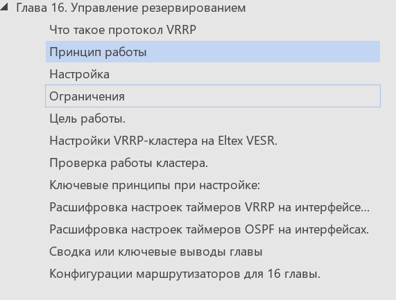

## Глава 16. [Управление резервированием]

### Что такое протокол VRRP

VRRP (Virtual Router Redundancy Protocol) --- сетевой протокол,
разработанный для повышения доступности и избыточности маршрутизаторов.
Позволяет нескольким маршрутизаторам работать как логическое устройство,
совместно используя виртуальный IP-адрес и MAC-адрес. 

Протокол существует в нескольких версиях: 

VRRPv2 --- поддерживает только IPv4, описан в RFC 3768.

VRRPv3 --- расширенная версия, поддерживает IPv4 и IPv6, описана в RFC
5798. 

### Принцип работы

Маршрутизаторы объединяются в один виртуальный маршрутизатор. Все
маршрутизаторы в группе имеют общий виртуальный IP-адрес (VIP) и общий
номер группы (VRID). В VRRP MAC-адрес автоматически генерируется на
основе номера группы VRRP. Используемый формат
MAC-адреса: 0000.5e00.01xx, где xx --- номер группы VRRP в
шестнадцатеричном виде.

В любой момент времени только один из физических
маршрутизаторов выполняет маршрутизацию трафика (VRRP Master). Все
остальные переходят в состояние резерва (VRRP Backup). 

При отказе главного маршрутизатора виртуальный MAC-адрес и VIP
присваиваются одному из резервных устройств. Таким образом
обеспечивается непрерывный доступ узлов к шлюзу даже в случае отказа
одного из устройств в рамках виртуального
маршрутизатора. 

Приоритет влияет на процесс распределения ролей: маршрутизатор с большим
приоритетом становится Master. Значение приоритета --- целое число в
интервале от 1 до
255. 

### Настройка

Узлы в сети настраиваются так, чтобы направлять пакеты на VIP-адрес
виртуального маршрутизатора, вместо IP-адресов физических интерфейсов.

Главное и резервное устройства периодически отправляют объявления
VRRP для поддержания своей доступности. Эти объявления включают
информацию о состоянии группы VRRP, такую как приоритет устройства и
IP-адрес.

Резервное устройство отслеживает состояние главного устройства, получая
объявления VRRP. Если резервное устройство не получает объявления от
главного устройства в течение определённого времени, оно считает, что
главное устройство неисправно, и запускает переключение.

 Сферы применения

Создание избыточных шлюзов по умолчанию --- VRRP гарантирует, что
сетевые устройства по-прежнему смогут получать доступ к внешним сетям,
если основной маршрутизатор обнаружит неисправность.

Балансировка нагрузки --- если создать несколько групп с разными VRID и
VIP, VRRP позволяет равномерно распределить нагрузку.

 

### Ограничения

IP-адрес на интерфейсе может быть задан только статически. 

Протокол не работает с интерфейсом многолучевого распространения по
IP-сети (IPMP) --- для VRRP требуются определённые MAC-адреса.

Переключение с основного маршрутизатора на резервный занимает некоторое
время, что приводит к безусловному разрыву установившихся соединений
поэтому использование этой технологии может быть критично для работы
сервисов IP телефонии или систем высокой достуности в реальном времени.

Некоторые преимущества использования VRRP в vESR:

Высокая доступность сети. VRRP предоставляет резервный маршрутизатор,
который может заменить основной в случае сбоя. Это гарантирует, что
сетевой трафик продолжит поступать даже при сбое.

Балансировка нагрузки. VRRP позволяет нескольким маршрутизаторам
совместно использовать виртуальный IP-адрес. Это помогает распределить
сетевой трафик между несколькими маршрутизаторами и повысить
производительность сети.

Лёгкость настройки и обслуживания. VRRP не требует сложных протоколов
маршрутизации или конфигураций.

Масштабируемость. VRRP поддерживает до 255 групп VRRP на подсеть и
несколько виртуальных маршрутизаторов на физический маршрутизатор.

### **Цель работы.**

В схеме подключения, описанной в предыдущей главе обеспечить
резервирование доступа через добавление второго маршрутизатора vesr в
офисе и подключении его к первому через протокол VRRP, для обеспечения
доступа к интернет в случае выхода зстроя одного из них, резрвирование
сервера DHCP, мэжсетевого экрана ( firewall) и автоматического
переключения туннелей.

Решение этой задачи обеспечивает добавление еще одного маршрутизатора с
именем vesr124-1-5 в систему в офисе и настройка протокола VRRP на нем c
добавлением команд резервирования сервисов firewall и dhcp.
Марщрутизатор с именем vesr124-1-2 будет назначен основным ( Master ) с
более высоким приоритетом, а маршрутизатор с именем vesr124-1-5 будет
назначен через меньший приоритет настройки запасным ( Backup ).

### Настройки VRRP-кластера на Eltex VESR.

Методика настройки VRRP-кластера на маршрутизаторах Eltex VESR
заключается в использовании механизма IP Failover для синхронизации
состояний и обеспечения высокой доступности.

Полный текст главы 16 на Бусти - 
