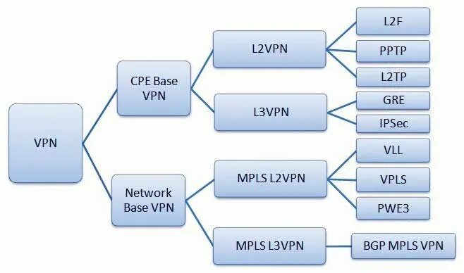
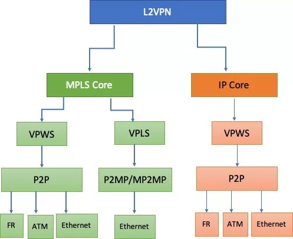
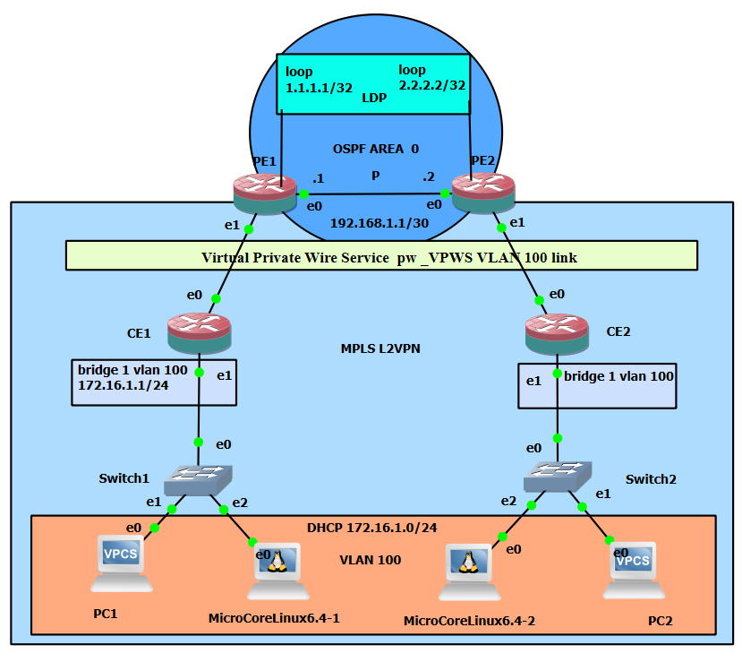

# Глава 18. Настройка MPLS L2VPN. 

### Что такое MPLS L2VPN.

MPLS L2VPN --- это технология виртуальной частной сети, которая работает
на втором уровне модели OSI, то есть уровне канала данных. 

Она позволяет интегрировать различные локальные сети в одну виртуальную
при помощи протоколов коммутации уровня 2: Ethernet, Frame Relay, ATM,
VPLS. Это обеспечивает прозрачную и безопасную передачу данных между
физически разделёнными сетями.

Некоторые виды MPLS L2VPN:

Point-to-Point (Pseudowire). Самая базовая форма, также известная как
Virtual Private Wire Service (VPWS). Соединяет два места, эмулируя
физическую арендуемую линию с помощью MPLS.

Virtual Private LAN Service (VPLS). Более сложная технология, которая
позволяет подключать несколько точек, имитируя традиционную локальную
сеть через сеть MPLS.

Иерархическая VPLS (H-VPLS). Расширение VPLS, которое упрощает
управление и масштабируемость больших развёртываний VPLS, вводя иерархию
в их архитектуру.

Типичное применение MPLS L2VPN --- объединение нескольких территориально
удалённых локальных сетей в одну, например локальных сетей офисов
филиалов предприятия.

{width="4.724409448818897in"
height="2.7856397637795274in"}

Рисунок 18-1. Виды VPN.

### Основные концепции

MPLS L2VPN VPWS (Virtual Private Wire Service) - это сервис
типа \"виртуальный провод\", который создает точка-точка соединение
между двумя клиентскими устройствами (CE).

MPLS L2VPN VPLS (Virtual Private LAN Service) - это сервис
типа \"виртуальный свитч\", который создает многоточечную эмуляцию сети
Ethernet.

Сравнительная таблица VPWS vs VPLS

  -----------------------------------------------------------------------
  Критерий                   VPWS                  VPLS
  -------------------------- --------------------- ----------------------
  Топология                  Точка-точка (P2P)     Многоточечная (MP2MP)

  Широковещательный домен    Изолирован для каждой Общий для всех
                             пары                  участников

  Изучение MAC-адресов       Нет                   Да

  Широковещательный трафик   Не поддерживается     Поддерживается

  Масштабируемость для N     Плохая (N×(N-1)/2     Хорошая (N соединений)
  сайтов                     соединений)           

  Нагрузка на CPU            Низкая (часто         Высокая (требует
                             аппаратно ускоряется) L2-свитчинга)

                                                   
  -----------------------------------------------------------------------

{width="4.724409448818897in"
height="3.8591940069991253in"}

Рисунок 18-2. Типы L2VPN.

### Когда что выбирать?

VPWS идеален для:

Соединения двух дата-центров (DCI)

Прозрачной связи между двумя маршрутизаторами

Сервисов с простой и предсказуемой топологией

VPLS применяется для:

Построения распределенной корпоративной сети

Объединения филиалов в единую LAN

Сервисов с multicast-трафиком

Практические аспекты и предупреждения

### Производительность на оборудовании Eltex ESR

Важное замечание о нагрузке на процессор:

При выборе между VPWS и VPLS на платформах типа Eltex ESR (и многих
других маршрутизаторах) критически важно учитывать разницу в нагрузке на
ресурсы процессора:

VPLS (с использованием bridge-domain) реализует полноценный L2-свитчинг,
что подразумевает изучение MAC-таблиц, обработку широковещательного
трафика и STP. Эти операции, как правило, сильно нагружают центральный
процессор.

VPWS (на субинтерфейсах) является по сути простой инкапсуляцией
L2-кадров в MPLS-tunnel (\"прозрачный провод\"). Данная операция часто
может быть аппаратно ускорена и оказывает минимальное влияние на CPU.

Вывод: в сценариях \"точка-точка\", где не требуется широковещательный
домен, VPWS является предпочтительным выбором с точки зрения
производительности и стабильности.

### Проблема одинаковых MAC-адресов в GNS3

В процессе настройки схем в GNS3 была обнаружена важная практическая
проблема: бриджи получали одинаковый MAC-адрес. Это происходило потому,
что виртуальные машины или образы оборудования в GNS3 часто генерируют
MAC-адреса из одного пула или на основе одинакового алгоритма.

Последствия:

Нарушение коммутации кадров

\"Плавающие\" MAC-адреса в таблице коммутации

Нестабильная работа L2-сервисов

Решение:\
Назначать вручную на каждом бридже уникальный MAC-адрес:

bash

\# Пример для оборудования Eltex ESR

interface bridge100

mac-address 00:50:56:11:11:11

Рекомендация: Всегда назначать уникальные MAC-адреса для
bridge-интерфейсов в лабораторных стендах, чтобы избежать конфликтов.

### Чем различаются L2VPN и L3VPN:

Это два основных типа виртуальных частных сетей (VPN) с использованием
технологии MPLS (Multiprotocol Label Switching). Они отличаются способом
обеспечения связи и маршрутизации между сайтами клиентов и сетью
провайдера. 

L2VPN создаёт частные соединения между двумя сайтами в IP или MPLS-сети,
копируя физическую подсеть. Сеть провайдера выступает виртуальным
коммутатором для каждого клиента, а сайты клиентов соединены виртуальным
каналом, который может передавать любой протокол уровня L2, например
Ethernet, Frame Relay или ATM. 

L3VPN позволяет передавать пакеты с использованием только одного
протокола IP через сетевой уровень (Network L3). Сеть провайдера
действует как виртуальный маршрутизатор для каждого клиента, а сайты
клиентов обмениваются информацией о маршрутизации IP с провайдером с
помощью таких протоколов, как BGP или OSPF. 

Некоторые другие различия:

Пересылка пакетов.

L3VPN пересылает IP-пакеты на основе меток, а L2VPN --- пакеты Ethernet
с MAC-адресами.

Механизм сигнализации.

L3VPN использует обмен протоколом маршрутизации BGP между
маршрутизаторами CE и PE для обмена информацией о маршрутизации внутри
каждой VPN. L2VPN имеет больше вариантов топологии, таких как
точка-точка или мультиточка, и стандарты для сигнализации этих
соединений через ядро MPLS.

Контроль. L3VPN лучше масштабируется для больших сетей, но некоторые
клиенты предпочитают L2VPN, чтобы сохранять контроль над маршрутизацией
в своём частном домене, а не полагаться на информацию о маршрутизации
провайдера.

Таким образом, L3VPN больше подходит для клиентов, которые хотят
передать маршрутизацию и безопасность провайдеру, а L2VPN --- для тех,
кто хочет поддерживать собственные политики маршрутизации и
безопасности. 

В этой главе рассмотрим Point-to-Point (Pseudowire) и Virtual Private
LAN Service (VPLS) формы организации vpn.

L2VPN делится на две модели или типа. Одна из них основана на базовой
сети MPLS, а другая --- на базовой IP-сети.

На рисунке ниже показаны две модели и их подразделения. Как уже было
сказано выше, в этой главе будет рассматриваться только ядро MPLS.

L2VPN, как следует из названия, представляет собой сервис E2E
уровня. Кадры данных пересылаются на основе информации уровня 2
(MAC-адрес, идентификатор VLAN, VCI и т. д.). Поставщику услуг (SP) не
нужно заботиться о маршрутах от клиента, топологии клиентской сети и
маршрутизации. Интересно отметить, что в модели VPLS для L2VPN метки
VPLS и информация уровня 2 распределяются между узлами через уровень
данных и уровень управления, а в L3VPN маршруты и метки VPN
распределяются между узлами через MP-BGP, который работает на уровне
управления.

- Настройка сервиса L2VPN в режиме Martini mode (VPWS)

**Martini Mode)** включает настройку виртуального канала (pseudo-wire)
для передачи Ethernet-фреймов через MPLS-домен. В этом режиме для
сигнализации меток используется протокол LDP, который уже является
частью MPLS.

Особенности настройки:

Удалённые LDP-сессии создаются для каждого виртуального коммутатора
(VSI) не с одним соседом, а с несколькими.

Каждому участнику VPLS выделяется индивидуальная метка, которая
передаётся в сообщении LDP Label Mapping Message.

Если в VPLS-домен добавляется новый PE, необходимо настроить
LDP-соседство со всеми существующими PE этого VPLS, после чего новый PE
обменяется метками.

Требования

IP-связность между устройствами PE. 

Функционирование MPLS-транспорта на основе LDP.

Настройка IGP (например, OSPF или EIGRP) на устройствах PE для
распределения IP-маршрутов. 

Настройка интерфейсов для поддержки конечных точек туннеля Martini: тип
инкапсуляции должен поддерживаться интерфейсом, роль для интерфейса ---
установлена на Access. 

Пошаговая инструкция

Предварительная настройка. Например, проверить возможности интерфейсов,
включить MPLS на всех необходимых интерфейсах, настроить использование
LDP. 

Создание конечных точек --- интерфейсов или субинтерфейсов,
поддерживающих требуемый тип инкапсуляции данных. 

Настройка VPN --- создание объекта Layer 2 Martini VPN, задание
параметров и назначение конечных точек туннелю. 

Применение конфигурации --- после настройки сведений о двухточечном
соединении Martini уровня 2 и управления соответствующими устройствами
нужно зафиксировать транзакцию. 

Возможные ошибки

Ошибка при создании VC --- может быть связана с тем, что LDP не включён
на интерфейсе, где подключается устройство PE. Решение: включить LDP на
этом интерфейсе.

Несовместимость режимов инкапсуляции --- например, если на двух PE,
подключающихся к клиентам, режимы инкапсуляции отличаются, это может
привести к ошибке. Решение: проверить режимы инкапсуляции интерфейсов и,
если нужно, изменить их.

### Цель работы.

В этой лабораторной работе нужно соединить в общий широковещательный
домен локальные сети двух офисов, используя технлогию MPLS L2VPN в двух
вариантах-VPWS и VPLS. В качестве основы будет использована созданная в
предыдущей главе транспортная сеть провайдера и клиентские сети двух
офисов.

### Настройка сервиса L2VPN Martini mode

Задача:

Настроить l2vpn таким образом, чтобы интерфейс ge1/0/1.100
маршрутизатора CE1 и интерфейс ge1/0/1.100 маршрутизатора CE2 работали в
рамках одного широковещательного домена.

{width="4.724409448818897in"
height="4.211496062992126in"}

Рисунок 18-3. Схема подключения филиалов по схеме MPLS L2VPN VPWS.

### Решение настройки L2VPN VPWS:

Предварительно нужно:

Включить поддержку Jumbo-фреймов с помощью команды system
jumbo-frames (для вступления изменений в силу требуется перезагрузка
устройства);

Настроить IP-адреса на интерфейсах согласно схеме сети, приведенной на
рисунке 18-3 выше;

Организовать обмен маршрутами между PE1 и PE2 при помощи IGP-протокола
(OSPF, IS-IS, RIP).

Все эти шаги уже сделаны в рамках настройки MPLS сети в предыдущей
главе.

На маршрутизаторе PE1 создадим саб-интерфейс, на который будем принимать
трафик от CE1, предварительно очистив настройку vrf:

Полный текст главы 18 на Бусти - 
